# ミラー反射 実装ロジック解説

Unity 6 / URP における車載ミラー（平面反射鏡）の実装について、  
数学的背景と 2 種類の実装方式を図解とともに解説します。

---

## 目次

1. [反射の基礎数学](#1-反射の基礎数学)
2. [実装方式の比較](#2-実装方式の比較)
3. [行列演算方式の詳細](#3-行列演算方式の詳細)
4. [ベクトル演算方式の詳細](#4-ベクトル演算方式の詳細)
5. [オブリーク投影（背面クリップ）](#5-オブリーク投影背面クリップ)
6. [URP との統合](#6-urp-との統合)
7. [パフォーマンス最適化](#7-パフォーマンス最適化)
8. [参考資料](#8-参考資料)

---

## 1. 反射の基礎数学

### 1.1 反射ベクトルの計算

平面鏡に光が入射したとき、反射ベクトル **R** は入射ベクトル **I** と法線 **N** から求まります。



**数式:**

```
R = I - 2 (I · N) N
```

- **I**: 入射ベクトル（メインカメラ → ミラー面）
- **N**: ミラー面の単位法線ベクトル
- **·**: 内積（ドット積）

> Unity では `Vector3.Reflect(I, N)` が同じ計算を実行します。

---

### 1.2 平面反射行列

単位法線 **N = (a, b, c)** による平面反射行列 **M** は  
恒等行列 **I** から法線外積を 2 倍引いた行列で表されます。

```
M = I - 2 * N * Nᵀ
```

平面が原点を通らない場合（距離項 **d** を持つ場合）、4x4 同次座標行列に拡張します。  
平面方程式を `ax + by + cz + d = 0`（d = -dot(N, P)）とすると：



**性質:**
- 行列式 `det(M) = -1`（ハンドネス＝三角形の巻き順が反転する）
- 対称行列（M = Mᵀ）
- 逆行列が自分自身（M² = I）

---

## 2. 実装方式の比較

| 比較項目 | 行列演算方式 | ベクトル演算方式 |
|---------|------------|--------------|
| スクリプト | `MirrorCamera.cs` | `MirrorCameraVector.cs` |
| カメラ操作 | `worldToCameraMatrix` を直接書き換え | `transform` の位置・回転を設定 |
| `GL.invertCulling` | **必要**（行列式 -1 による巻き順反転を補正） | **不要** |
| Renderer Feature | **必要**（`MirrorRenderFeature.cs`） | **不要** |
| オブリーク投影 | 標準で適用 | オプションで適用可能 |
| 精度 | 高い（数値的に安定） | ジンバルロック対策が必要 |
| セットアップ | やや複雑 | シンプル |

---

## 3. 行列演算方式の詳細

### 3.1 ビュー行列への反射行列乗算

Unity のビュー行列 `V_main` はメインカメラのワールド → カメラ空間への変換です。  
これに反射行列 **M** を右から掛けることで、  
ミラーカメラのビュー行列を算出します。

```
V_mirror = V_main × M
```



**なぜこれが正しいか？**

ミラー平面上の点 **P** に対して、`M × P = P` が成り立つ（平面上の点は反射しても不変）。  
したがって：

```
V_mirror × P = V_main × M × P = V_main × P
```

平面上の点はメインカメラとミラーカメラで**同じスクリーン座標**になる。  
これがスクリーン空間 UV でサンプリングできる理由です。

---

### 3.2 コードの対応

```csharp
// MirrorReflectionMatrix.cs
// 平面方程式 (a,b,c,d) から 4x4 反射行列を構築
public static Matrix4x4 CalculateReflectionMatrix(Vector4 plane)
{
    float a = plane.x, b = plane.y, c = plane.z, d = plane.w;
    // M_ij = delta_ij - 2 * n_i * n_j
    ...
}

// MirrorCamera.cs
// ビュー行列 = メインカメラのビュー行列 × 反射行列
_mirrorCam.worldToCameraMatrix = _mainCamera.worldToCameraMatrix * reflectionMatrix;
```

---

### 3.3 GL.invertCulling が必要な理由

反射行列の行列式は `-1` のため、  
変換後の三角形は**巻き順（winding order）が逆転**します。



`GL.invertCulling = true` で判定を逆にすることで、  
反射後も表面として正しく描画されます。

**URP での実装:**

```
BeforeRenderingOpaques       → GL.invertCulling = true   ← InvertCullingBeginPass
       ↓ (ミラーカメラの描画)
AfterRenderingPostProcessing → GL.invertCulling = false  ← InvertCullingEndPass
```

---

## 4. ベクトル演算方式の詳細

### 4.1 処理の流れ



```csharp
// ① 入射ベクトル I（メインカメラ → ミラー面）
Vector3 I = (mirrorPos - mainCamera.transform.position).normalized;

// ② 反射ベクトル R = I - 2*(I·N)*N
Vector3 R = Vector3.Reflect(I, mirrorNormal);

// ③ ミラーカメラを反射方向へ向ける
mirrorCamera.transform.rotation = Quaternion.LookRotation(R, upVec);

// ④ ミラーカメラをミラー面の手前に配置
mirrorCamera.transform.position = mirrorPos - mirrorNormal * offset;
```

---

### 4.2 ジンバルロック対策

`Quaternion.LookRotation(forward, up)` は `forward` と `up` が平行のとき破綻します。



**対策:** 内積の絶対値で平行を検出し、`right` 方向にフォールバックする。

```csharp
Vector3 upVec = (Mathf.Abs(Vector3.Dot(R, mirrorUp)) > _gimbalLockThreshold)
    ? _mirrorTransform.right   // フォールバック
    : mirrorUp;                // 通常時
```

---

### 4.3 行列方式との巻き順の違い

ベクトル方式では `transform` を直接動かすため  
Unity が通常の worldToCameraMatrix を計算します。  
反射行列を経由しないので**巻き順の反転は起きません**。

```
行列方式:   worldToCameraMatrix = mainViewMatrix × M（det = -1）→ 反転する
ベクトル方式: worldToCameraMatrix = transform から自動計算（det = +1）→ 反転しない
```

---

## 5. オブリーク投影（背面クリップ）

### 5.1 通常の投影 vs オブリーク投影

通常の near クリップ平面はカメラの視線に対して垂直です。  
ミラー平面より後ろのオブジェクトが映り込む場合があります。



### 5.2 計算手順

```csharp
// 1. ミラー平面をカメラ空間へ変換
Vector4 clipPlane = MirrorReflectionMatrix.GetCameraSpacePlane(
    mirrorCam, mirrorPos, mirrorNormal, sideSign: 1f);

// 2. CalculateObliqueMatrix でオブリーク投影行列を生成
mirrorCam.projectionMatrix = mirrorCam.CalculateObliqueMatrix(clipPlane);
```

`CalculateObliqueMatrix` は既存の投影行列の near 面を  
指定した平面で置き換える Unity 標準の API です。

---

## 6. URP との統合

### 6.1 レンダリング順序

Unity URP はカメラの `depth` 値が小さい順にレンダリングします。



### 6.2 シェーダーでのサンプリング（スクリーン空間 UV）

```hlsl
// 頂点シェーダー
output.screenPos = ComputeScreenPos(output.positionHCS);

// フラグメントシェーダー
float2 uv = input.screenPos.xy / input.screenPos.w;  // パースペクティブ補正
half4 col = SAMPLE_TEXTURE2D(_MirrorTex, sampler_MirrorTex, uv);
```



**前提条件:** RenderTexture のアスペクト比 = メインカメラのアスペクト比  
→ 本実装では縦解像度をメインカメラのアスペクトから自動計算して保証。

### 6.3 Render Graph 対応（Unity 6）

Unity 6 URP では `Execute` が obsolete となり、  
`RecordRenderGraph` の実装が必須になりました。

```csharp
// AddUnsafePass: Render Graph 管理外で直接 GL コマンドを発行できる
public override void RecordRenderGraph(RenderGraph renderGraph, ContextContainer frameData)
{
    using var builder = renderGraph.AddUnsafePass<PassData>("MirrorInvertCullingEnable", out _);
    builder.AllowPassCulling(false);
    builder.SetRenderFunc(static (PassData _, UnsafeGraphContext _) =>
    {
        GL.invertCulling = true;  // 巻き順反転の補正
    });
}
```

---

## 7. パフォーマンス最適化

### 7.1 フレームスキップ

```
Frame Skip = 1  → 毎フレーム描画（60fps → ミラーも 60fps）
Frame Skip = 2  → 2フレームに1回（60fps → ミラーは 30fps）
Frame Skip = 4  → 4フレームに1回（60fps → ミラーは 15fps）
```

カメラを `enabled = false` にすることで URP が描画をスキップ。  
RenderTexture には前フレームの内容が残るため画面は更新されない（静止）。

### 7.2 解像度スケール

```
解像度スケール 1.0  → 512 × 288 px（16:9 の場合）
解像度スケール 0.5  → 256 × 144 px（負荷 約 1/4）
解像度スケール 0.25 → 128 × 72 px （負荷 約 1/16）
```

### 7.3 可視性カリング

`Renderer.isVisible` を使い、ミラーメッシュが画面外の場合は描画しません。

```
Renderer.isVisible = true  → ミラーカメラを描画
Renderer.isVisible = false → ミラーカメラを無効化（描画コスト = 0）
```

> `isVisible` は前フレームの可視性を返しますが、  
> カリング判定として 1 フレームの遅れは許容範囲です。

---

## 8. 参考資料

### 実装の参考

| タイトル | 説明 |
|---------|------|
| [Unity Community Wiki - MirrorReflection](https://wiki.unity3d.com/index.php/MirrorReflection4) | 本実装が参考にしたビュー行列乗算方式の原典（Unity 4 時代の実装、URP 対応前） |
| [Unity Blog - Planar Reflections in URP](https://blog.unity.com/engine-platform/srp-batcher-speed-up-your-rendering) | SRP/URP における描画パイプラインの解説 |

### Unity 公式ドキュメント

| タイトル | 説明 |
|---------|------|
| [URP Custom Renderer Feature](https://docs.unity3d.com/Packages/com.unity.render-pipelines.universal@latest/index.html?subfolder=/manual/renderer-features/create-custom-renderer-feature.html) | ScriptableRendererFeature の作成方法 |
| [Render Graph in URP](https://docs.unity3d.com/Packages/com.unity.render-pipelines.universal@latest/index.html?subfolder=/manual/render-graph-introduction.html) | Unity 6 URP の Render Graph API 解説 |
| [Camera.CalculateObliqueMatrix](https://docs.unity3d.com/ScriptReference/Camera.CalculateObliqueMatrix.html) | オブリーク投影行列の API リファレンス |
| [Camera.worldToCameraMatrix](https://docs.unity3d.com/ScriptReference/Camera-worldToCameraMatrix.html) | ビュー行列の直接設定 |
| [GL.invertCulling](https://docs.unity3d.com/ScriptReference/GL-invertCulling.html) | カリング方向の反転 |
| [RenderPipelineManager.beginCameraRendering](https://docs.unity3d.com/ScriptReference/Rendering.RenderPipelineManager-beginCameraRendering.html) | URP でのカメラレンダリング前コールバック |

### 数学的背景

| タイトル | 説明 |
|---------|------|
| [Reflection across a plane - Wikipedia](https://en.wikipedia.org/wiki/Reflection_(mathematics)) | 平面反射の数学的定義 |
| [Householder transformation - Wikipedia](https://en.wikipedia.org/wiki/Householder_transformation) | 反射行列（Householder 変換）の一般形 `M = I - 2 * n * nᵀ` |
| [Oblique projection - Wikipedia](https://en.wikipedia.org/wiki/Oblique_projection) | オブリーク投影の概念 |

### 関連する Unity パッケージ・サンプル

| タイトル | 説明 |
|---------|------|
| [URP Package Samples](https://docs.unity3d.com/Packages/com.unity.render-pipelines.universal@latest/index.html?subfolder=/manual/package-samples.html) | URP 公式サンプルシーン集 |
| [Graphics - Mirror Planar Reflection (URP Samples)](https://github.com/Unity-Technologies/UniversalRenderingExamples) | Unity Technologies による URP レンダリングサンプル |
